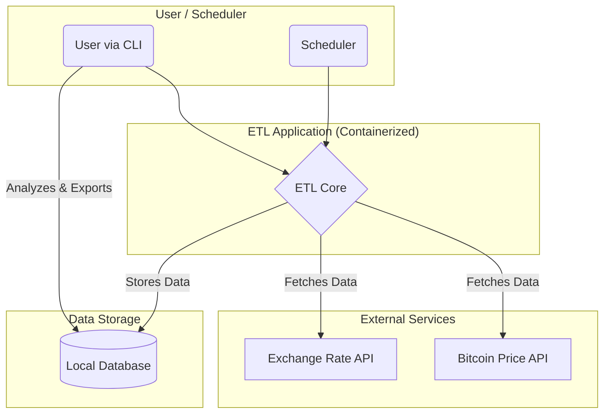

# 📈 Bitcoin Price ETL & Analysis CLI

[](.python-version)
[](LICENSE)
[](https://github.com/Jcnok/etl_bitcoin/commits/main)
[](https://github.com/Jcnok/etl_bitcoin/actions/workflows/python-ci.yml)

Este projeto implementa um pipeline de ETL (Extração, Transformação e Carga) completo, encapsulado em uma poderosa ferramenta de linha de comando (CLI), para buscar, analisar e exportar dados de preço do Bitcoin. É uma solução robusta, configurável e pronta para produção, ideal para automação de coleta de dados financeiros.

## ➤ Por que este projeto importa?

Este repositório demonstra um conjunto de habilidades de engenharia de software aplicadas a um problema prático de dados. Para um recrutador técnico, ele evidencia:

-   **⚙️ Engenharia de Software:** Código modular e bem estruturado, CLI com design claro (`argparse`), tratamento robusto de erros e um sistema de logging profissional.
-   **🤖 Automação e DevOps:** Um pipeline de CI/CD configurado com GitHub Actions para garantir a qualidade do código e a execução de testes a cada commit.
-   **📦 Containerização:** O uso do Docker para criar um ambiente de execução portátil e consistente, simplificando o deploy e a replicação do projeto.
-   **💻 Arquitetura de Sistema:** Uma aplicação *configuration-driven*, onde o comportamento (URLs de API, cotações, agendamento) é controlado por variáveis de ambiente (`.env`), uma prática essencial em sistemas modernos.
-   **📊 Manipulação de Dados:** Um pipeline ETL funcional que consome dados de APIs, realiza transformações e os armazena de forma estruturada, além de prover funcionalidades para análise e exportação.

## ✨ Principais Funcionalidades

-   **🤖 Pipeline de ETL Automatizado:** Busca preços de Bitcoin e cotações de câmbio de APIs externas.
-   **⏰ Agendamento Inteligente:** Executa a coleta de dados em intervalos configuráveis usando a biblioteca `schedule`.
-   **🔧 CLI Abrangente:** Interface de linha de comando com `argparse` para interagir com o sistema (`fetch`, `schedule`, `history`, `stats`, `export`).
-   **⚙️ Configuração Centralizada:** Gerenciamento de todas as configurações via arquivo `.env`.
-   **📊 Análise de Dados On-the-fly:** Calcule estatísticas como preço mínimo, máximo, médio e variação percentual nas últimas 24 horas.
-   **📤 Exportação Flexível:** Exporte o histórico de preços para formatos `CSV` ou `JSON`.
-   **🐳 Suporte a Docker:** Rode a aplicação em um contêiner para uma experiência de setup simplificada e consistente.

## 🛠️ Stack Tecnológica

| Ferramenta         | Propósito                                                   |
| :----------------- | :---------------------------------------------------------- |
| **Python 3.12**    | Linguagem principal.                                        |
| **Poetry**         | Gerenciamento de dependências e ambiente virtual.           |
| **Docker**         | Containerização da aplicação para portabilidade.            |
| **requests**       | Requisições HTTP para consumo de APIs.                      |
| **TinyDB**         | Banco de dados NoSQL leve para armazenamento de dados.      |
| **schedule**       | Agendamento de tarefas.                                     |
| **argparse**       | Construção da interface de linha de comando (CLI).          |
| **tabulate**       | Criação de tabelas formatadas para a saída da CLI.          |
| **pytest**         | Framework para testes unitários.                            |
| **GitHub Actions** | Automação do pipeline de Integração Contínua (CI).          |

## 🗺️ Arquitetura

O diagrama abaixo ilustra a arquitetura de alto nível e o fluxo de dados do sistema.



## 🚀 Começando

Existem duas maneiras de executar este projeto: usando Docker (recomendado para simplicidade) ou configurando um ambiente de desenvolvimento local.

### 🐳 Rodando com Docker (Recomendado)

Este método garante um ambiente consistente e não requer a instalação de Python ou Poetry em sua máquina local.

**1. Clone o repositório:**
```bash
git clone https://github.com/Jcnok/etl_bitcoin.git
cd etl_bitcoin
```

**2. Configure o ambiente:**
Crie um arquivo `.env` a partir do exemplo. Nenhuma alteração é necessária para começar.
```bash
cp .env.example .env
```

**3. Construa a imagem Docker:**
```bash
docker build -t etl_bitcoin .
```

**4. Execute os comandos da CLI:**
Use `docker run` para executar qualquer comando da CLI. Os volumes `-v` garantem que os dados e logs sejam salvos em sua máquina local.

```bash
# Busca o preço uma vez
docker run --rm -v $(pwd)/db:/app/db -v $(pwd)/logs:/app/logs --env-file .env etl_bitcoin fetch

# Mostra o histórico de preços
docker run --rm -v $(pwd)/db:/app/db -v $(pwd)/logs:/app/logs --env-file .env etl_bitcoin history
```

### 💻 Configuração do Ambiente Local

**1. Pré-requisitos:**
- Python 3.12
- Poetry

**2. Clone o repositório:**
```bash
git clone https://github.com/Jcnok/etl_bitcoin.git
cd etl_bitcoin
```

**3. Instale as dependências:**
```bash
poetry install
```

**4. Configure o ambiente:**
```bash
cp .env.example .env
```

**5. Execute a aplicação:**
```bash
poetry run python -m src.main fetch
```

## ⚙️ Uso da CLI

A CLI é a principal forma de interagir com a aplicação.

| Comando                             | Descrição                                                              |
| :---------------------------------- | :--------------------------------------------------------------------- |
| `python -m src.main fetch`          | Executa o pipeline de ETL uma vez.                                     |
| `python -m src.main schedule`       | Executa o pipeline de ETL continuamente no intervalo definido no `.env`. |
| `python -m src.main history`        | Mostra os últimos 10 registros de preço em uma tabela.                 |
| `python -m src.main stats`          | Exibe estatísticas (mín, máx, média, variação) das últimas 24h.         |
| `python -m src.main export --format csv` | Exporta todos os dados para `db/prices.csv`.                         |
| `python -m src.main export --format json` | Exporta todos os dados para `db/prices.json`.                        |

**Opções de exportação:**
- `--output <filename>`: Especifique um nome de arquivo de saída customizado.

## 📂 Estrutura do Projeto

```
etl_bitcoin/
├── .github/             # Configurações do CI/CD com GitHub Actions
├── db/                  # Armazena o banco de dados e arquivos exportados
├── logs/                # Armazena os logs da aplicação
├── src/                 # Código fonte principal da aplicação
│   ├── __init__.py
│   ├── cli.py           # Lógica dos comandos 'history', 'stats', 'export'
│   ├── config.py        # Carregamento e validação de variáveis de ambiente
│   ├── logger.py        # Configuração do logger
│   ├── main.py          # Ponto de entrada da CLI (argparse) e orquestração do ETL
│   └── scheduler.py     # Lógica de agendamento de tarefas
├── tests/               # Testes unitários com pytest
├── .dockerignore        # Arquivos a serem ignorados pelo Docker
├── .env.example         # Arquivo de exemplo para variáveis de ambiente
├── Dockerfile           # Define a imagem Docker da aplicação
├── poetry.lock          # Dependências travadas para builds reprodutíveis
└── pyproject.toml       # Definição do projeto e suas dependências
```

## 📬 Contato

**Júlio Cesar Okuda**

-   **Email:** julio.okuda@gmail.com
-   **LinkedIn:** [https://www.linkedin.com/in/juliookuda/](https://www.linkedin.com/in/juliookuda/)
