# 📈 ETL de Dados de Bitcoin

[](.python-version)
[](LICENSE)
[](https://github.com/seu-usuario/etl_bitcoin/commits/main)
[](https://github.com/seu-usuario/etl_bitcoin/actions/workflows/python-ci.yml)

> **Nota:** Lembre-se de atualizar os badges com seu usuário e nome de repositório do GitHub.

Este repositório é um template **production-ready** para a construção de um pipeline de ETL (Extração, Transformação e Carga) para dados de Bitcoin.

O principal valor de negócio é **acelerar o desenvolvimento**, fornecendo uma base sólida com automação de qualidade (testes e linting) e integração contínua (CI) já configuradas. Isso permite que a equipe de desenvolvimento foque na lógica de negócio e na entrega de valor, em vez de gastar tempo com a configuração do ambiente.

## Fluxo de Dados

O diagrama abaixo ilustra a arquitetura de alto nível pretendida para a aplicação.

```mermaid
graph TD
    A[API Externa de Bitcoin] --> B[Processamento e Transformação];
    B --> C[Armazenamento de Dados];
```



## Stack Tecnológica

| Ferramenta | Propósito |
| :--- | :--- |
| **Python 3.12** | Linguagem principal para o desenvolvimento do ETL. |
| **Poetry** | Gerenciamento de dependências e ambiente virtual. |
| **requests** | Extração de dados de APIs HTTP. |
| **pytest** | Framework para testes automatizados. |
| **GitHub Actions**| Orquestração do pipeline de Integração Contínua (CI). |

## Início Rápido (Quick Start)

```bash
# 1. Clone o repositório e entre na pasta
git clone https://github.com/jcnok/etl_bitcoin.git && cd etl_bitcoin

# 2. Instale as dependências
poetry install

# 3. Execute os testes para validar o ambiente
poetry run pytest
```

## Estrutura do Projeto

```
etl_bitcoin/
├── .github/
│   └── workflows/
│       └── python-ci.yml
├── src/
│   └── # Lógica principal do ETL
├── tests/
│   └── test_example.py
├── .pre-commit-config.yaml
├── pyproject.toml
└── README.md
```
